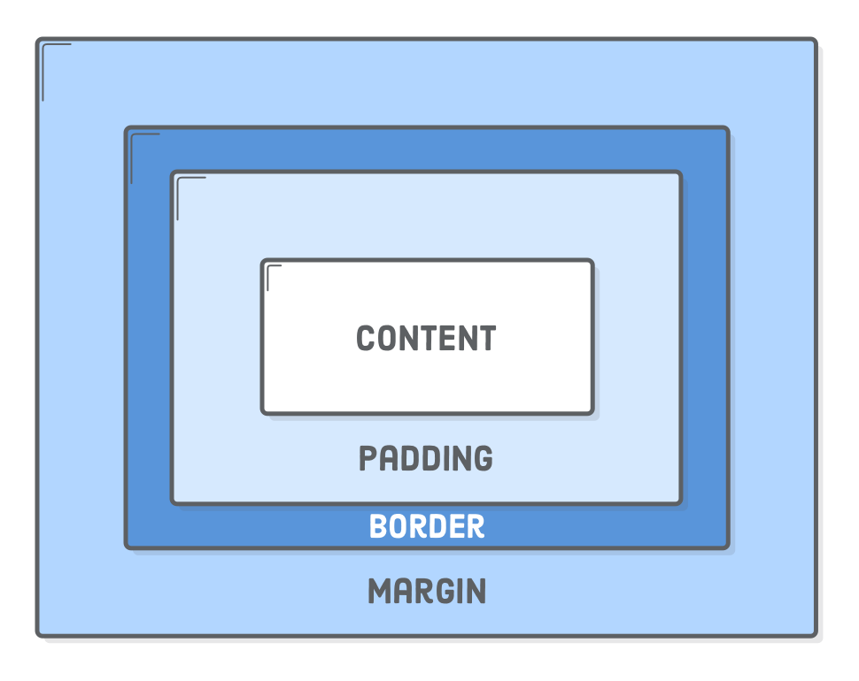

# Laying Out a Web Page with CSS
In the last chapter, we talked about how to style elements. Now let's talk about how to position elements on the page.

## The Box Model
Here's a secret: every web page you've ever seen is made up of boxes. We create layouts with CSS by specifying how big these boxes should be, how far apart, where they should sit in relation to each other, etc.

Every box is made up of four things:
1. **Content** - the amount of space that the actual element takes up. Content is determined by setting the `height` and `width`. 
1. **Padding** - the amount of space between the content and the border. Padding can be set on each individual side (`padding-left`, `padding-right`, etc) or all at once with the shorthand property `padding`. 
1. **Border** - You can read about all the cool things you can do with borders [here](https://www.w3schools.com/css/css_border.asp).
1. **Margin** - the amount of space between this box and the next box. Margin can be set on each individual side (`margin-left`, `margin-right`, etc) or all at once with the shorthand property `margin`. 



## Layout

#### Inline, Block, and Inline-Block
We can also control whether elements appear side-by-side in a row or on their own line. 
```css
/* Headings are block level elements by default, which means they get their own line. We can ovverride that default style by giving all h3s a display property of "inline". You cannot set height or top or bottom margin/padding on inline elements*/
h3 {
  display: inline;
}

/* Buttons are inline elements by default. Let's say we want a submit button on it's own line, so we set its display property to "block".*/
.submit-btn{
  display: block;
}

/*Okay, what if we want things to appear side by side but we also want to be able to control their height, margin, and padding? "Inline-block" is the best of both worlds. */
.nav-link{
  display: inline-block;
}

```
#### Absolute and Relative Positioning
The `position` property determines where the element sits in relation to other elements.
```css
/*Elements with relative position appear relative to the their original position. Elements with this class will be 6px to the left of where they would normally sit. Other elements will not shift to make space for them.  */
.headshot{
  position: relative;
  left: 6px;
}

/*Elements with fixed position appear relative to the viewport (a.k.a the screen). Elements with this class will appear 1px away from the top of the screen and 1px away from the left side of the screen, and will stay there as the user scrolls.*/
.logo{
  position: fixed;
  top: 1px;
  left: 1px;
}

/*Elements with absolute position appear relative to their nearest positioned ancestor. Elements with this class will be positioned in the top right corner of their parent, so long as their parent has a position of anything other than static. (You usually see the parent with a position of "relative"). */
.x-btn{
  position: absolute;
  top: 0;
  right: 0;
}
```

#### Flexbox 
Flexbox is a very efficient tool for building responsive layouts that look great on any screen size. Start by giving the parent container a rule of `display: flex`. All of the children will line up inside it. You have complete control over how they line up and in what order. [Here's a great resource for working with flexbox.](https://css-tricks.com/snippets/css/a-guide-to-flexbox/)


# Practice


## Supplemental Material
[How to center anything with CSS](http://howtocenterincss.com/)